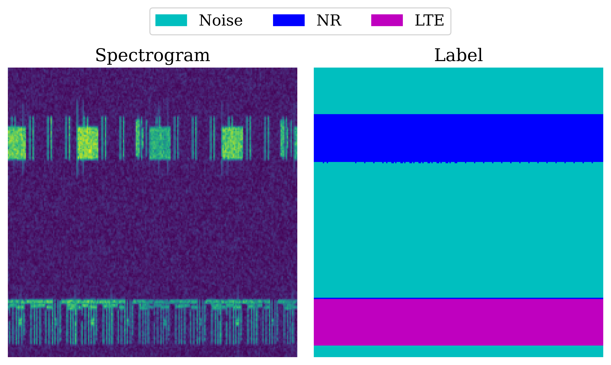

## Masked Spectrogram Modeling with Vision Transformers: A PyTorch Implementation

<p align="center">
  
</p>


This is a PyTorch implementation of the paper [Building 6G Radio Foundation Models with Transformer Architectures](https://arxiv.org/abs/2411.09996):
```
@article{aboulfotouh2024building6gradiofoundation,
      title={Building 6G Radio Foundation Models with Transformer Architectures}, 
      author={Ahmed Aboulfotouh and Ashkan Eshaghbeigi and Hatem Abou-Zeid},
      year={2024},
      journal={arXiv:2411.09996},
}
```
* This repo is a modification of the amazing [mae repo](https://github.com/facebookresearch/mae).
### Catalog

- [x] Pre-trained checkpoints + fine-tuning code
- [x] Pre-training code

The following table provides the pre-trained checkpoints at a masking ratio 75%.
<table><tbody>
<!-- START TABLE -->
<!-- TABLE HEADER -->
<th valign="bottom"></th>
<th valign="bottom">ViT-S</th>
<th valign="bottom">ViT-M</th>
<th valign="bottom">ViT-L</th>
<!-- TABLE BODY -->
<tr><td align="left">pre-trained checkpoint</td>
<td align="center"><a href="https://dl.fbaipublicfiles.com/mae/pretrain/mae_pretrain_vit_base.pth">download</a></td>
<td align="center"><a href="https://dl.fbaipublicfiles.com/mae/pretrain/mae_pretrain_vit_large.pth">download</a></td>
<td align="center"><a href="">download</a></td>
</tr>
<tr><td align="left">number of parameters</td>
<td align="center"><tt>30M</tt></td>
<td align="center"><tt>80M</tt></td>
<td align="center"><tt>300M</tt></td>
</tr>
</tbody></table>

The finetuning instructions are in [FINETUNE.md](FINETUNE.md).

The pretraining instructions are in [PRETRAIN.md](PRETRAIN.md).


### Visualization demo

Run our interactive visualization demo using [Colab notebook]() (no GPU needed):
<p align="center">
  
</p>

### Fine-tuning with pre-trained checkpoints
We finetune the pretrained models on two tasks: Spectrogram Segmentation and CSI-based human activity sensing.
### Spectrogram Segmentation
The task is to segment a spectrogram which includes 5G NR and LTE transmissions in neighboring bands, into three 
classes: NR, LTE and Noise.
<p align="center">
  
</p>

Mean accuracy on the segmentation task from finetuning the pretrained models:
<!-- START TABLE -->
<table>
<thead>
<tr>
<th></th>
<th colspan="3" align="center">Masking Ratio (%)</th>
<th>Scratch</th>
</tr>
<tr>
<th></th>
<th>70%</th>
<th>75%</th>
<th>80%</th>
<th></th>
</tr>
</thead>
<tbody>
<tr>
<td align="left">ViT-S</td>
<td align="center">97.0</td>
<td align="center">96.8</td>
<td align="center">96.4</td>
<td align="center">97.2</td>
</tr>
<tr>
<td align="left">ViT-M</td>
<td align="center"><b>97.9</b></td>
<td align="center">97.6</td>
<td align="center">97.5</td>
<td align="center">97.1</td>
</tr>
<tr>
<td align="left">ViT-L</td>
<td align="center">97.5</td>
<td align="center">97.3</td>
<td align="center">97.5</td>
<td align="center"><b>97.7</b></td>
</tr>
</tbody>
</table>


### CSI-based Human Activity Sensing


